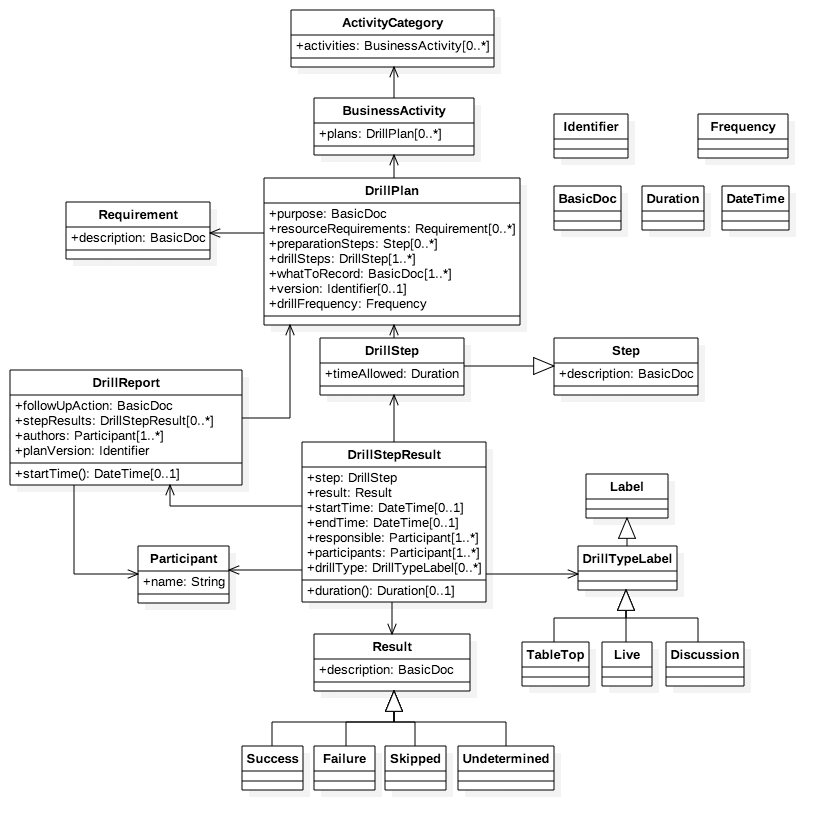

= BC Drill Model

This repo contains the model definition for drills and drill reports in the 
context of business continuity (BC), in the format of a UML diagram.

== The UML Diagram

.UML diagram describing the BC Drill model
[#img-model]
[caption="Figure 1: ",link=model.mdj]

DrillPlan::
* describes a drill plan.
* has a single *purpose*, in textual form.
* has a list of resource *Requirements*.
* has an ordered list of preparation *Steps*.
* has an ordered list of *DrillSteps*.
* has a description of what to record in the drill report.
* belongs to a *BusinessActivity*.

DrillStep::
* is a *Step* that contains a timeframe within which it is expected to complete.

Step::
* has a textual description of the procedure involved in the relevant context.

Requirement::
* has a textual description of the resource needed.

Result::
* has a textual description of the drill step result.
* can be one of *Success*, *Failure*, *Skipped* or *Undetermined*.

Success::
* is a *Result*.
* indicates a successful drill step.

Failure::
* is a *Result*.
* indicates a failed drill step.

Skipped::
* is a *Result*.
* indicates a skipped drill step.

Undetermined::
* is a *Result*.
* indicates a drill step of which the success is undetermined.

Participant::
* represents a person involved in the drill.

DrillStepResult::
* represents the detailed result for the *DrillStep* it corresponds with.
* has one or more responsible persons and participants.
* belongs to a *DrillReport*.
* Labels can be assigned as to the `drillType` of this *DrillStep*.
* `startTime` and `endTime` are optional.
* `duration()` is to be calculated from `endTime` and `startTime`.

DrillReport::
* has the detailed result of the drill, in the form of an ordered list of *DrillStepResults*.
* belongs to a *DrillPlan*, via `planVersion`.
* has one or more `authors`.
* has a description of `followUpAction`.
* has a `startTime()` determined from the `startTime` attribute of the first item in its `stepResults` list.

TableTop::
* is a *DrillTypeLabel*.
* indicates the corresponding drill step has been conducted as a table-top exercise.

Live::
* is a *DrillTypeLabel*.
* indicates the corresponding drill step has been conducted live.

Discussion::
* is a *DrillTypeLabel*.
* indicates the corresponding drill step has been conducted as a discussion.

DrillTypeLabel::
* is a *Label*.

Label::
* a generic class.

Identifier::
* a class for identifying a resource, e.g., a *UUID*, a *URI*, or any combination thereof.

Duration::
* indicates a duration in time.

DateTime::
* indicates a combination of local date and local time.

BasicDoc::
* a class of textual format.

BusinessActivity::
* contains a list of *DrillPlans*.
* belongs to one *ActivityCategory*.

ActivityCategory::
* contains a list of *BusinessActivities*.

--------

New model according to ISO 22301, 22313 and 22398:

[source,yaml]
----
plan:

  # purpose and scope
  purpose_scope: [ text ]
  
  # objectives and measures of success in terms of prioritized activities;
  objectives: [ text ]
  
  # who can invoke this plan
  authority: [ contact ]

  # when to invoke this plan
  invocation_criteria: [ text ]
  
  # how to invoke this plan
  procedure_invocation: [ procedure ]
  
  # when to stop this plan 
  standdown_criteria: [ text ] 
  
  # how to stop this plan
  procedure_standdown: [ procedure ]

  # procedures within the plan
  # "information flow and documentation processes" should
  # be documented within procedures
  procedures: [ procedure ]
  
  # contact information of relevant parties
  contact_information: [ contact ]
  
  # communication requirements and procedures
  communication: [ text ]
  
  # (non-resource) internal and external interdependencies and interactions
  # if any
  # (resource dependencies are stated within "procedures")
  dependencies: [ text ]
  

# Each procedure contains:
# - roles, responsibilities and authorities
procedure:
  - resource_needs: [ (resource_category, text) ]

    # resource_category:
    # - people
    # - information and data
    # - buildings, work environment and associated utilities
    # - facilities, equipment and consumables
    # - information and communication technology (ICT) systems
    # - transportation
    # - finance
    # - partners and suppliers

  - roles:
    - name: text
      responsibilities: [ text ]

  - description: [ text ]

exercise:
  objectives: [ text ]
  method: exercise_method
  scenario: [ scenario ]
  plans: [ plans ]
  schedule: time_range

# e.g. every 100 days
time_range:

exercise_result:
  exercise: exercise
  results: [ exercise_procedure_results ]

exercise_procedure_result:

  # reference to procedure
  procedure: procedure 

  # result of exercise on a procedure
  result_type: result_type
  
  # what happened when exercising the procedure
  records: [ text ]
  
  # more evidence of what happened
  # e.g. an image
  supporting_evidence: 
  
  # if the step failed what can we do better next time
  corrective_action: [ text ]
      
# e.g. Volcano eruption, flight traffic control down
scenario: text

exercise_method:
- discussion_seminar
- discussion_workshop
- discussion_tabletop
- discussion_game
- operational_simulation

result_type:
- skipped
- success
- failed
----
